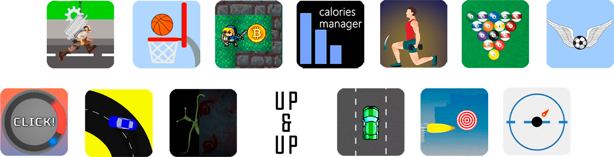

<h1 align="center">Hi, my name is Yaroslav </h1>

 

## About me
I'm a developer from Russia. My core specialization is **Unity development**. I've been working with Unity for over 4 years and have developed more than 30 projects.I thrive on solving complex problems and exploring new technologies.

---

## 🛠️ Core Unity Skills
### **Game Development**
- ✔️ **Advanced C# & OOP**: Clean architecture, game loops, design patterns  
- ✔️ **Multiplatform Development**: WebGL (Yandex Games), iOS/Android, PC  
- ✔️ **Multiplayer**: Mirror, NFG 
- ✔️ **Graphics & VFX**: Animations, Shaders, Particle Systems, Materials  
- ✔️ **UI/UX**: Adaptive interfaces for games and apps  

### **Tools & Pipelines**
- 🔧 **Unity Editor Mastery**: Optimisation, Editor Scripting, Asset Bundles  
- 🌐 **Backend Integration**: REST APIs, YandexSDK, Firebase  
- 🎮 **Game Mechanics**: Prototyping unique gameplay systems  

---

## 🔧 Additional Skills
- **Blender:** modeling and animations
- **Video/Arts/PR:** Adobe soft, CapCut, Movavi
- **Python, JavaScript, HTML, SQL**
- **Git**
---

## 💼 Work Experience
### **Hyper-Casual Game Developer** | Solo Projects 
- Developed **WebGL games** for Yandex Games - [Example DriftPro](https://github.com/S0ftPunk/Drift-Pro-For-YandexGames)  
- Full-cycle development: **Programmer, Game Designer, 3D Artist, PR Manager**  

### **Unity Developer** | Private Company
- Built **iOS/Android apps** ([Calorie Manager](https://github.com/S0ftPunk/Calories-Manager-App-For-IOS))  
- Integrated **Yandex/Firebase SDKs**, trained junior devs  
- Specialized in **API-driven features**  

### **Game Jam Participant** | Team Projects
- Led programming in **48-hour jams**  
- Focus: Rapid prototyping, team coordination  

---

## 🎓 Education
**Bachelor's in Game Development**  
Don State Technical University (DGTU) | 2021–2025  

---

## 🌟 Personal Traits
- 🔥 **Driven by challenges** and complex systems  
- 🧠 **Continuous learner** (new tech, workflows)  
- 🏋️ **Balanced lifestyle**: Fitness + mental health focus  
- 🤝 **Team player** with mentorship experience  

---

